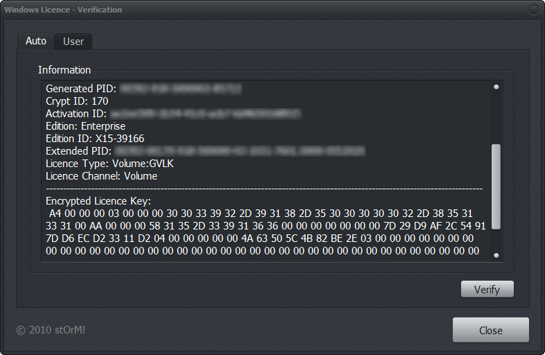

# Windows Product Key Verification

Did you ever wanted to know how to validate a given Windows licence key and know it is a genuine one?

You can read about the details on my Blog

[private-storm/windows-7-product-key-verification](http://private-storm.de/2010/06/01/windows-7-product-key-verification/)

Basically this works while using undocumented functions in the pidgenx.dll found in system32 folder.

In the moment I'll run about different HDD's of mine to have a look if they're still working or not. Sometimes I'll found old code which might be useful or interesting to you.
So I've found this one.

This is tested on Windows 7 64Bit SP1 it might work with XP too but I can not guarantee this.

The Demo uses two different ways to validate your key.

The first one (while beeing in the Auto interface) it will try to fetch all needed information on its own and validates a key when found.

The second one (manual interface) will work with the data provided by the user.

**Auto Interface**

**Manual Interface**

> Remember the validation process takes its time. If you need a responsive UI or need to validate a list of keys I'll suggest doing this in a different thread because it will freeze your main thread.
